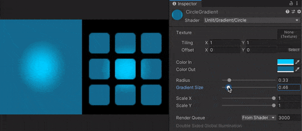
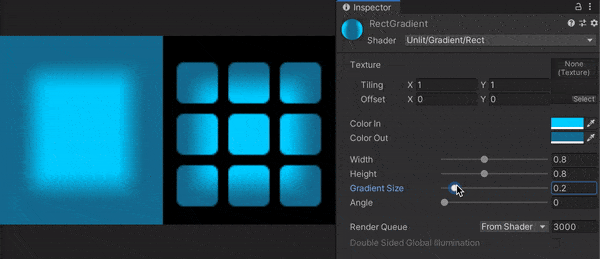

# Unity Helpful Shaders
Helpful shaders for unity

## Linear Gradient
Fully customizable linear gradient.  
If you need a gradient background it's better way to use a shader instead of fullscreen texture to optimize memory usage. 
You can set start and end gradient color as well as width and angle of gradient.

## Circle Gradient

## Ring Gradient

## Rectangle Gradient

